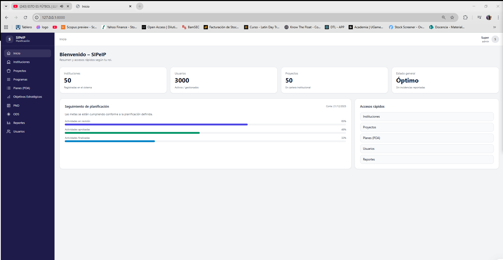

# SIPeIP - Sistema Web de Planificación Institucional

SIPeIP es una aplicación web desarrollada con **Laravel** como proyecto de tesis, orientada a la gestión de procesos de planificación institucional. El sistema permite administrar instituciones, proyectos, programas, planes, objetivos estratégicos, PND, ODS, usuarios, roles y reportes.

## Descripción del proyecto

El proyecto fue desarrollado con el objetivo de digitalizar y organizar la planificación institucional, permitiendo registrar información estratégica, vincular proyectos con objetivos institucionales, alinear la planificación con el Plan Nacional de Desarrollo y los Objetivos de Desarrollo Sostenible, además de generar reportes para el seguimiento y control.

La aplicación busca reemplazar procesos manuales o dispersos por una plataforma centralizada, segura y ordenada, facilitando la toma de decisiones y el control de la información institucional.

## Funcionalidades principales

- Inicio de sesión y autenticación de usuarios.
- Gestión de usuarios.
- Control de roles y permisos.
- Registro y administración de instituciones.
- Gestión de proyectos.
- Gestión de programas.
- Gestión de planes institucionales.
- Registro de objetivos estratégicos.
- Gestión de PND.
- Gestión de ODS.
- Alineación de proyectos con objetivos, PND y ODS.
- Generación de reportes.
- Exportación de reportes en PDF.
- Interfaz web administrativa.

## Tecnologías utilizadas

- PHP
- Laravel
- Blade
- Vue.js
- Inertia.js
- TailwindCSS
- Vite
- MySQL
- Laravel Breeze
- Laravel Sanctum
- Spatie Laravel Permission
- Dompdf

## Módulos del sistema

### Instituciones

Permite registrar y administrar la información de las instituciones dentro del sistema.

### Proyectos

Permite crear, editar, consultar y gestionar proyectos institucionales.

### Programas

Permite organizar los programas relacionados con la planificación institucional.

### Planes

Permite administrar planes institucionales y asociarlos a la estructura de planificación.

### Objetivos

Permite registrar objetivos estratégicos para orientar la planificación institucional.

### PND y ODS

Permite vincular la planificación institucional con el Plan Nacional de Desarrollo y los Objetivos de Desarrollo Sostenible.

### Reportes

Permite generar reportes para el análisis, control y seguimiento de la información registrada.

### Usuarios y roles

Permite gestionar usuarios del sistema y controlar el acceso mediante roles y permisos.

## Capturas del sistema

### Panel principal



### Gestión de proyectos


### Gestión de planes


### Reportes


## Instalación y ejecución local

1. Clonar el repositorio:

```bash
git clone https://github.com/Larksenio/practicum_4.1.git
```

2. Entrar a la carpeta del proyecto:

```bash
cd practicum_4.1
```

3. Instalar dependencias de PHP:

```bash
composer install
```

4. Instalar dependencias de Node.js:

```bash
npm install
```

5. Copiar el archivo de entorno:

```bash
cp .env.example .env
```

En Windows PowerShell:

```bash
copy .env.example .env
```

6. Generar la clave de la aplicación:

```bash
php artisan key:generate
```

7. Configurar la base de datos en el archivo `.env`:

```env
DB_DATABASE=nombre_base_datos
DB_USERNAME=usuario
DB_PASSWORD=contraseña
```

8. Ejecutar migraciones:

```bash
php artisan migrate
```

9. Ejecutar el servidor de Laravel:

```bash
php artisan serve
```

10. Ejecutar Vite:

```bash
npm run dev
```

11. Abrir en el navegador:

```bash
http://127.0.0.1:8000
```

## Estructura general del proyecto

```txt
practicum_4.1/
│
├── app/                  # Lógica principal de la aplicación
├── bootstrap/            # Archivos de arranque de Laravel
├── config/               # Configuración del sistema
├── database/             # Migraciones, seeders y factories
├── public/               # Archivos públicos
├── resources/            # Vistas Blade, componentes y estilos
├── routes/               # Rutas del sistema
├── storage/              # Archivos generados por Laravel
├── tests/                # Pruebas del sistema
├── artisan               # Consola de comandos de Laravel
├── composer.json         # Dependencias PHP
├── package.json          # Dependencias frontend
└── README.md             # Documentación del proyecto
```

## Mi rol en el desarrollo

Desarrollé el sistema como parte de mi proyecto de tesis, participando en:

- Análisis de requisitos del sistema.
- Diseño de la estructura del proyecto.
- Implementación de módulos administrativos.
- Desarrollo de operaciones CRUD.
- Configuración de autenticación.
- Gestión de roles y permisos.
- Desarrollo de vistas con Blade, Vue y TailwindCSS.
- Implementación de reportes.
- Configuración de base de datos.
- Documentación del proyecto.

## Estado del proyecto

Proyecto académico funcional desarrollado como tesis.  
Repositorio disponible para revisión técnica y presentación en portafolio profesional.

## Autor

Desarrollado por **Andrés Miller**  
GitHub: **Larksenio**
